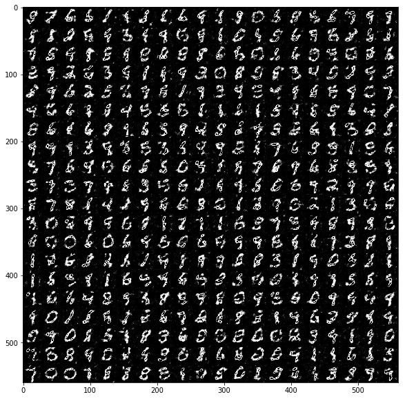

# A Tutorial on Generative Adversarial Networks

This is an introduction to [Generative Adversarial Networks (GANs)](https://arxiv.org/abs/1406.2661) and how they can be used to generate photos of handwritten digits. In particular, we will use an architecture that is is similar to the [DCGAN](https://arxiv.org/abs/1511.06434) proposed by Radford et al.

The core idea of GANs is to combine two neural networks with distinct tasks: a **generator** and a **descriminator**. The first tries to produce realistic images from random noise, while the latter tries to distinguish the generated images from the *real* images. The following analogy is taken from Goodfellow et al.'s [original paper on GANs](https://arxiv.org/abs/1406.2661):

> The generative model can be thought of as analogous to a team of counterfeiters, trying to produce fake currency and use it without detection, while the discriminative model is analogous to the police, trying to detect the counterfeit currency. Competition in this game drives both teams to improve their methods until the counterfeits are indistiguishable from the genuine articles.

In this notebook, I present a simple and straightforward implementation of GANs and how they can be used in practice. If you have any question, suggestions, etc., feel free to contact me!
